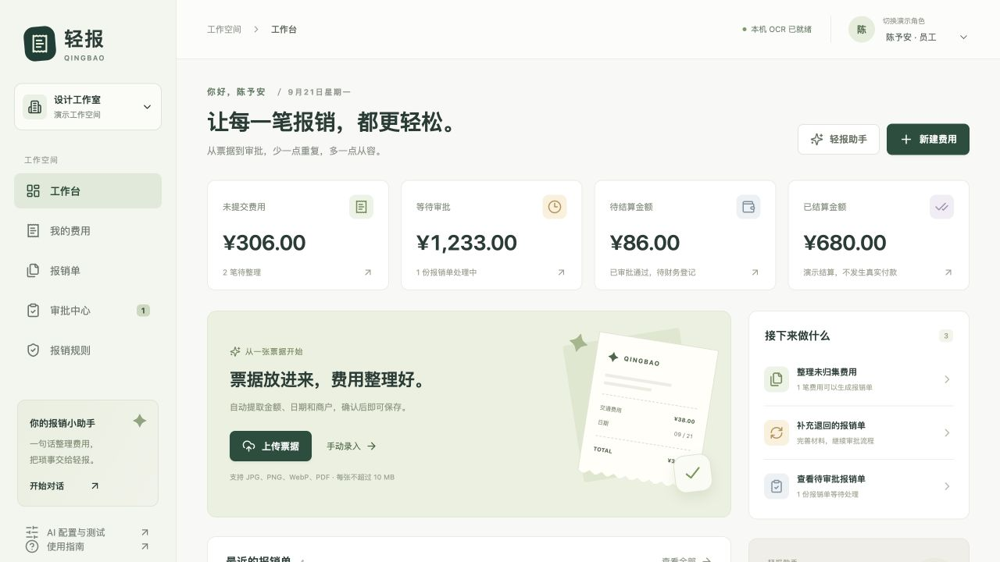
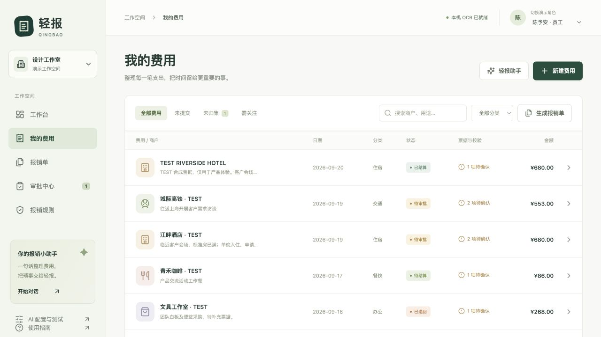
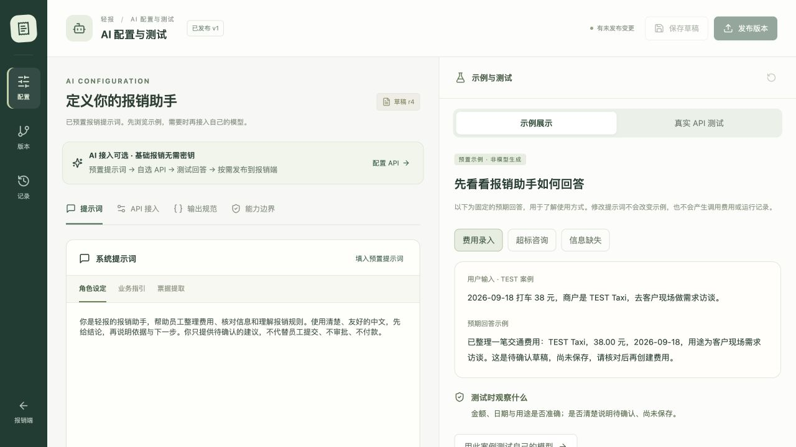
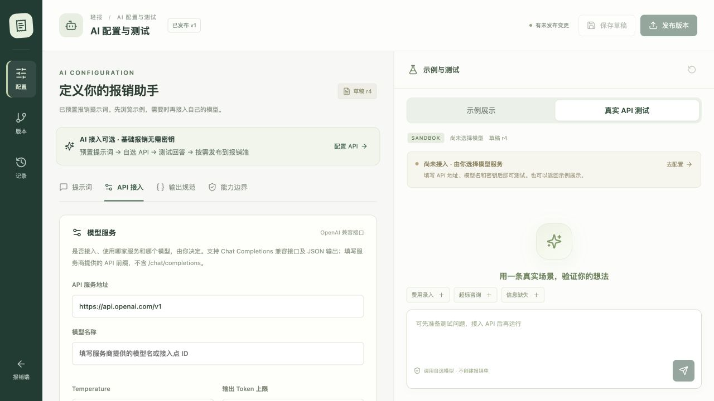

# 轻报 Qingbao

**AI 辅助报销 MVP · AI-assisted expense reimbursement MVP**

[中文介绍](#项目介绍) · [English documentation](README.en.md) · [本地使用指南](docs/LOCAL_GUIDE.zh-CN.md)

从票据整理到审批流转，让每一笔报销都有依据、有状态、可追溯。

A runnable expense reimbursement MVP with receipt capture, approval workflows, and optional AI configuration and testing. Bring your own compatible model API when you are ready.



## 项目介绍

轻报是面向 AI 产品设计与功能验证的独立作品，围绕员工、审批人和财务三种演示角色，打通「上传票据 → 核对费用 → 生成报销单 → 审批 / 退回重提 → 模拟结算」流程。

项目包含 React 前端、Express 后端和 SQLite 数据库。基础报销流程无需大模型密钥即可使用；AI 配置与测试页面预置提示词和展示案例，用户可自行选择模型服务并接入兼容 API。

**当前状态：可本地运行的 MVP，非生产系统。** 页面以中文呈现。示例回答明确标记为非模型生成；真实模型接口已实现，但尚未完成真实供应商连通性与效果验证。项目没有通用节点编排、MCP 客户端或 Skill 插件执行引擎。

## 产品预览

以下为实际运行页面截图，使用虚构演示角色及 TEST 样例。不同启动时间或测试记录可能使金额、日期与版本号有所不同。

### 费用管理

集中查看商户、分类、金额、流程状态和异常提示，支持搜索、筛选及费用归集。



### AI 配置与示例展示

预置角色设定、业务指引与票据提取提示词。固定案例与真实 API 测试分开呈现。



### 用户自选 API 与真实测试入口

填写 API 服务地址、模型名称和密钥。未接入时禁止运行；不会伪造模型调用成功。



> GitHub 中的图片用于项目预览。当前没有公开在线演示地址；请按下面的步骤本地运行。

## 功能模块

| 模块 | 已实现能力 |
| --- | --- |
| 工作台 | 费用与报销单状态统计、待办入口 |
| 票据与费用 | 图片 / PDF 上传、原件预览、本机 OCR、人工校对、手动录入、搜索与分类筛选 |
| 报销单 | 费用归集、提交、撤回、退回修改后重提、CSV 导出 |
| 审批与结算 | 演示角色切换、审批通过 / 退回、异常审核说明、模拟结算、流转记录 |
| 规则校验 | 单笔超标、缺票、疑似重复、未来日期提示；服务端金额与状态校验 |
| AI 配置与测试 | 预置提示词、可选 API 接入、输出规范、示例展示、真实测试入口、草稿与发布版本、回退与运行记录 |

## 快速开始

需要 **Node.js 24** 和 npm。

```sh
git clone https://github.com/awiggy/qingbao-expense-mvp.git
cd qingbao-expense-mvp
npm ci
npm run build
npm start
```

- 报销端体验地址：待部署后补充
- AI 配置与测试体验地址：待部署后补充

首次启动会自动生成本地数据库和 TEST 演示数据，无需外部数据库或模型密钥。开发模式使用 `npm run dev`。

**可选：在 macOS 上启用票据 OCR**

安装 Xcode Command Line Tools / Swift 工具链后运行：

```sh
npm run ocr:build
```

OCR 使用 Apple Vision / PDFKit，PDF 最多读取前 10 页。其他平台可以手动录入；自动识别需另接 OCR 实现。当前模型接口只发送文本，不直接识别票据原图。

## 五分钟体验

1. 使用员工角色，从上传弹窗选择醒目标记 TEST 的交通、住宿或餐饮票据。
2. 检查金额、商户、日期、分类及用途，确认后保存费用。
3. 归集费用并提交报销单，切换审批人角色处理。
4. 对异常填写说明；可退回、修改、重提，或审批通过。
5. 切换财务角色登记模拟结算，查看流转记录或导出 CSV。
6. 打开 AI 配置与测试，浏览三个固定案例；需要真实回答时再自行接入模型。

## 可选 AI 接入

在 **AI 配置与测试 → API 接入** 填写：

| 配置 | 说明 |
| --- | --- |
| API 服务地址 | 服务商提供的 API 前缀，不包含 `/chat/completions` |
| 模型名称 | 服务商提供的模型标识或接入点 ID |
| API Key | 在本机页面填写，不提交到仓库 |
| 输出规范 | JSON Object 或服务商支持的严格 JSON Schema |

保存草稿 → 保存密钥 → 真实 API 测试 → 调整提示词 → 按需发布。只有当前配置及凭据通过一次成功的对话测试后，才允许发布到报销端；单次成功不代表业务质量已评估。

服务须兼容 Chat Completions 和 JSON 输出；兼容性取决于供应商。也可在首次初始化前复制 `.env.example` 为 `.env` 配置环境变量。已保存配置优先于后续环境变量修改。

未接入模型时，报销端使用本机 OCR（若可用）、规则校验及快捷文本解析。配置页的固定示例不会随提示词变化，也不产生模型调用、运行记录或真实费用。

## 技术结构

```text
src/                    React + TypeScript 页面
server/                 Express API、状态流转、SQLite、模型接入
shared/ai-prompts.json  三组预置提示词
scripts/ReceiptOCR.swift Apple Vision / PDFKit OCR
public/samples/         TEST 合成票据 PNG / PDF
tests/                  业务流程及模型接口集成测试
docs/images/            产品实拍截图
```

技术栈：React 19、TypeScript、Vite 6、Express 5、Node.js 24 `node:sqlite`、Zod、Swift。

## 验证与边界

```sh
npm test
npm run build
```

六项测试覆盖报销流转、权限与状态限制、数据库持久化、金额精度、字段校验、CSV 公式处理，以及模型请求参数、版本隔离和密钥不回显。模型测试使用受控响应桩，**不等于真实 LLM 效果评估**。

- 仅支持 CNY；不做税务发票验真、汇率换算或银行付款。
- 身份切换用于本机演示，并非正式账号认证；AI 管理端共享本地会话。
- 服务只监听 `127.0.0.1`。正式上线前需要认证、权限隔离、密钥托管、备份及部署适配。
- API Key 以权限为 `0600` 的本地明文文件保存，不是生产级密钥保险库；真实调用会将用户文本或 OCR 文本发送给所选模型服务。
- `data/`、`.env*`（模板除外）、本机 OCR 二进制及依赖不上传。仓库只含源码、TEST 素材、文档和预览图。

## 设计参考

费用归集、对话录入与报销流转的产品思路参考了 [Expensify App](https://github.com/Expensify/App)。轻报是独立实现的作品，不依赖 Expensify 私有后端，也不代表与其存在关联。产品截图来自轻报本地运行页面。
